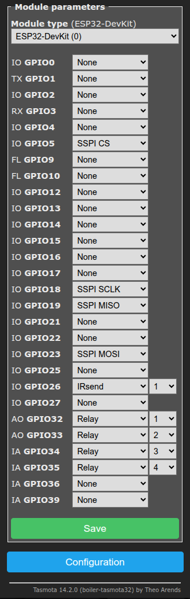
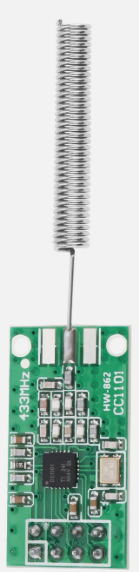
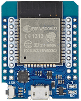
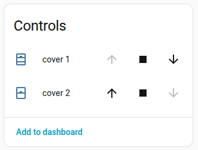

# Tasmota-SomfyRTS
A Berry script to to control Somfy powered blinds from Home Assistant using Tasmota.

## How it works
- It emulates a Somfy RTS controller like a [Telis 4 RTS](https://www.somfy.co.uk/products/1810648/telis-4-soliris-rts) or [SITUO 5 RTS](https://www.somfy.co.uk/products/1870495/situo-5-rts-pure-color) using standard Tasmota features and components. Once setup, you can pair the Tasmota to the blind in the same way that you pair a Somfy controller to a blind.
- We provide Tasmota with a Berry script that uses Tasmota's support for Shutters and Blinds to provide standard `cover` entities that Home Assistant can discover and control.
- We use the `IRsend` component (rather than RFsend) to send the data because it allows us to send raw packets that we can construct in the Berry script.
- Tasmota's support for Shutters and Blinds controls the blinds using relays, so we provide it with _virtual_ relays. The physical relays do not exist, but changes in their GPIOs can trigger Tasmota rules. When we see the Up relay operate, we will construct a Somfy Up command and send it using `IRsend`.
- We use a custom build of the Tasmota firmware.
  - We need two standard Tasmota features, `Full IR Support` and `Shutters and Blinds`. However, none of the standard Tasmota binaries include these two features together. Furthermore, it is highly desirable to set `#define IR_SEND_USE_MODULATION 0` which is not available in the standard builds. No source code is changed.
  - Pre-built firmware files are provided on this project page.

## History of this project
  - The README.md has been simplified, focused on Home Assistant, and assumes familiarity with Tasmota.
  - Berry persistence fix:
    - v1.1.x worked with Tasmota v12.0.2, but broke some releases after that, see [arendst/Tasmota#22187](https://github.com/arendst/Tasmota/issues/22187).
    - Without persistence, a crash or power-cycle could cause the RollingCode to reset, which may then cause the Somfy blind to ignore further messages. Controlled restarts were fine.
    - This version (v1.2.x) uses persist.dirty(), which works from Tasmota v14.2.0, and possibly earlier releases.
  - Tasmota Shutters and Blinds integration:
    - This part of the code has been improved and tidied, but functionality is the same.

## Installation overview
  - Use a multi-core ESP32, such as the ESP32 or ESP32-S3 (Not the ESP32-S2 or ESP32-C3).
  - Flash the ESP32 with Tasmota and connect it to a CC1101 transmitter module with 7 wires. (For some applications, the simpler FS1000A transmitter module may be sufficient. See [this discussion](#using-a-simple-fs1000a-transmitter-module).)
  - Download the Tasmota ESP32 firmware from this project, and upgrade your Tasmota using this image. Or, [build your own firmware](#building-you-own-firmware).
  - Download the Berry files from this project and upload them to your Tasmota's filesystem.
  - Assign GPIOs for the transmitter. The CC1101 transmitter module will use four SSPI pins and one IRsend pin, as well as 3.3V and GND. You can choose any pins that are convenient.
  - Assign GPIOs for the _virtual_ Up/Down relays.
    - The GPIOs must be real GPIOs that appear on the Tasmota `Configure module` page, but do not need to be available as pins on the ESP32 module.
  - Configure the blinds in Tasmota.
  - Pair this 'virtual' Somfy controller to your Somfy blind.
  - Test and admire!

## Installation procedure
  - This example is for two blinds. We will need to configure 4 _virtual_ relays; an Up and a Down relay for each of the two blinds.

### Flash the ESP32 with Tasmota and discover the device in Home Assistant
- Take your ESP32 or ESP32-S3 module and flash it with the default Tasmota firmware (not the firmware from this project). Configure it using your normal procedure and check that it appears in the list of Home Assistant devices.
- Tasmota in Home Assistant requires an MQTT broker (such as HA's Mosquitto Addon) and the Tasmota integration.
- For my installation, I configured the following items in Tasmota:
  - `Hostname tas-somfy`, `DeviceName tas-somfy`, `Topic tas-somfy`, `FriendlyName tas-somfy`, `MqttUser XXXX`, `MqttPassword XXXX`, `MqttHost 192.168.1.XXX`.

### Upgrade the Tasmota firmware
- Download the tasmota.bin file appropriate to your ESP32 module from this project and upgrade your Tasmota with it. (Or, use [your own firmware](#building-you-own-firmware).)
- `Tasmota` > `Firmware Upgrade` > `Choose file` > `Start upgrade`.

### Assign GPIOs
- You will need to configure each of the GPIOs in the list below. The particular GPIO numbers you choose depend on the physical layout of the module and how you will wire it. These GPIO numbers work nicely for the ESP32-D1-Mini module. Skip the SSPI GPIOs if you are using an [FS1000A](#using-a-simple-fs1000a-transmitter-module) transmitter module.
- `Tasmota` > `Configuration` > `Module`.




### Connect the CC1101 transmitter module to your ESP32
- This requires 7 wires.
- Ensure you use a 433MHz version of this module. Carefully check the pinout: similar-looking modules have slightly different pinouts.
- (The [FS1000A](#using-a-simple-fs1000a-transmitter-module) uses just 3 wires: 5V, IRsend and GND.)

<table>
  <tr>
    <th>CC1101</th>
    <th>ESP32</th>
    <th colspan="2">Modules</th>
  </tr>
  <tr>
    <td>3V3</td>
    <td>3V3</td>
    <td rowspan="8" align="center" valign="bottom">
      
    </td>
    <td rowspan="8" align="center" valign="bottom">
      
    </td>
  </tr>
  <tr><td>SCK</td><td>SSPI SCLK</td></tr>
  <tr><td>MISO</td><td>SSPI MISO</td></tr>
  <tr><td>MOSI</td><td>SSPI MOSI</td></tr>
  <tr><td>CSN</td><td>SSPI CS</td></tr>
  <tr><td>GDO0</td><td>IRsend</td></tr>
  <tr><td>GDO2</td><td><em>not used</em></td></tr>
  <tr><td>GND</td><td>GND</td></tr>
</table>


### Upload the Berry files to Tasmota
- Download the two Berry files from this project page (`autoexec.be` and `RFtxSMFY_V2.be`), and upload them to your Tasmota's file system.
- `Tasmota` > `Tools` > `Manage File system` > `Choose file` > `Upload`.

### Configure the blinds in Tasmota
- Go to the Tasmota console: `Tasmota` > `Tools` > `Console`.
- Type the following commands:
  ```
  SetOption80 1        # Enable shutters and blinds
  Interlock 1,2 3,4    # Set interlocks, so that Up and Down relays cannot be On at the same time
  Interlock 1          # Enable interlocks, required by ShutterMode
  ShutterMode 1        # Blinds will use one relay for Up and another relay for Down
  ShutterRelay1 1      # Relay 1 and 2 will be Up and Down for Blind 1
  ShutterRelay2 3      # Relay 3 and 4 will be Up and Down for Blind 2
  ShutterOpenDuration1 9.5
  ShutterCloseDuration1 8
  ShutterOpenDuration2 9.5
  ShutterCloseDuration2 8
  Restart 1            # Ensures Home Assistant discovers the new Cover entities
  ```
At this point, you should see Shutter controls on the Tasmota main UI page, and `cover` entities on the HA device page.
<p>
  
  
</p>
At some point, set the Open and Close durations to match the actual time it takes your blinds to open and close.

### Pair the Tasmota with your blinds
- Initialize a controller instance: Go to the Tasmota Console and type `RFtxSMFY {"Idx":1,"Id":101,"RollingCode":1}`.
- Take your existing Somfy controller and press the `Prog` button until the blind briefly jogs up and down. _The Prog button is on the back of the controller, and requires a paperclip to press it._
- In the Tasmota Console, type `RFtxSMFY {"Idx":1,"Button":8}`. This emulates a press of the `Prog` button on the new controller, and the blind should jog up and down to confirm the pairing.
- Test: Go to the Tasmota main UI page and click the Up and Down buttons for the blind.
- Repeat the procedure for the second blind using these commands: `RFtxSMFY {"Idx":2,"Id":102,"RollingCode":1}`, `RFtxSMFY {"Idx":2,"Button":8}`
- Home Assistant should have discovered the `cover` entities when Tasmota was restarted. Go to the Device page for this Tasmota: You should be able to operate the blinds using the buttons on this page. On your Dashboard, you can create a `cover` card and link it to these entities.


----
----
----
----


## Technical details

### Troubleshooting
- The Tasmota Console should look like like this:
```
# Tasmota Restart 1
00:00:00.001 HDW: ESP32-D0WD-V3 v3.0 
00:00:00.047 UFS: FlashFS mounted with 264 kB free
00:00:00.058 CFG: Loaded from File, Count 34
00:00:00.066 QPC: Count 1
00:00:00.069 SPI: Soft using GPIO18(CLK), GPIO23(MOSI) and GPIO19(MISO)
00:00:00.113 BRY: Berry initialized, RAM used 3266 bytes
00:00:00.122 SHT: Use defaults
00:00:00.122 SHT: About to load settings from file /.drvset027
00:00:00.137 Project tasmota - tas-somfy Version 15.1.0(Somfy)-3_3_0(2025-11-03T10:42:57)
00:00:00.138 SHT: ShutterMode: 1
00:00:00.139 SHT: ShutterMode: 1
00:00:00.386 BRY: Successfully loaded 'autoexec.be'
00:00:02.001 WIF: Connecting to AP1 ASSIDX Channel 1 BSSId 74:83:C2:AB:CD:EF in mode HT40 as tas-somfy...
00:00:03.958 WIF: Connected
11:15:28.084 HTP: Web server active on tas-somfy with IP address 192.168.X.XX
11:15:29.160 MQT: Attempting connection...
11:15:29.183 MQT: Connected
11:15:29.186 MQT: tele/tas-somfy/LWT = Online (retained)


# ShutterOpen1 
10:57:00.901 MQT: stat/tas-somfy/RESULT = {"POWER1":"ON"}
10:57:00.903 MQT: stat/tas-somfy/POWER1 = ON
10:57:00.905 MQT: stat/tas-somfy/RESULT = {"Shutter1":{"Position":37,....
10:57:01.374 MQT: stat/tas-somfy/RESULT = {"IRSend":"Done"}
10:57:01.450 MQT: stat/tas-somfy/RESULT = {"Shutter1":{"Position":43,....
10:57:01.925 MQT: stat/tas-somfy/RESULT = {"Shutter1":{"Position":47,....
10:57:02.928 MQT: stat/tas-somfy/RESULT = {"Shutter1":{"Position":58,....
10:57:03.966 MQT: stat/tas-somfy/RESULT = {"Shutter1":{"Position":69,....
10:57:05.015 MQT: stat/tas-somfy/RESULT = {"Shutter1":{"Position":80,....
10:57:05.941 MQT: stat/tas-somfy/RESULT = {"Shutter1":{"Position":90,....
10:57:06.890 MQT: stat/tas-somfy/RESULT = {"POWER1":"OFF"}
10:57:06.893 MQT: stat/tas-somfy/POWER1 = OFF
10:57:06.897 MQT: stat/tas-somfy/SHUTTER1 = 100
10:57:06.898 MQT: stat/tas-somfy/RESULT = {"Shutter1":{"Position":100,"Direction":0,"Target":100,"Tilt":0}}
10:57:07.487 SHT: About to save settings to file /.drvset027
```

- If the `RFtxSMFY` command is **Unknown**, then there is an error in loading `autoexec.be` or `RFtxSMFY_V2.be`.
- If the `IRsend` command gives a **format error**, then you may have only the base-level IR support, and not the Full IR support.
- Attach a led (via a 220R resistor) to the `IRsend` pin. You should see it flash when a command is sent.
- To view the transmitted signal, you can use a cheap 433Mhz receiver module with a cheap [FX2 LA](https://sigrok.org/wiki/Fx2lafw) Saleae/PulseView compatible logic analyzer. The waveform and timings should look similar to the signal from the Somfy controller.

### If you need to change the ESP32 module
- From your old ESP32 module, save `_persist.json` from the filesystem. Change the device names and topic to avoid clashing with the new device.
- In HA, delete the Tasmota device. Restart HA (this removes the orphaned entities).
- Set up the new ESP32 device using the instructions above, using the same name as the old unit, but skip the pairing procedure.
- Remove `autoexec.be`. Restart.
- Upload `_persist.json` and `autoexec.be`. Restart. (The `Id` and `RollingCode` are contained in `_persist.json`, thus maintaining the pairing.)
- In HA, on the Device page, go to the `...` menu and select `Recreate entity IDs`.
- The blinds should now operate as before.

### Using a simple FS1000A transmitter module
<p></p>

- The advantage of the FS1000A transmitter module is that you may already have one, it is quick to connect needing only 3 wires, and it is breadboard-friendly. However, it uses the common 433.92MHz frequency, whereas Somfy uses a more unusual 433.42MHz. The 433.92MHz signal should be fine within 2m - 3m distance of the blind, so may be adequate for testing and some applications.
- You can modify the FS1000A to 433.42MHz by changing the SAW device, but I suggest the better solution is to use the CC1101 which has a programmable frequency.
- Connect the FS1000A's Data pin to the IRsend GPIO, and do not configure the 4 SSPI GPIOs. This will cause an error message in the console; optionally set `hasCC1101 = 0` at the top of `RFtxSMFY` to suppress the error.

### Building you own firmware
- TasmoCompiler
  - TasmoCompiler on GitPod runs in the cloud and used to be the easiest method, but now (I think) requires you to register a payment card, even for the Free Tier. Follow [this link](https://gitpod.io/#https://github.com/benzino77/tasmocompiler).
  - TasmoCompiler on your local machine is very easy if you already have docker set up. Follow [these instructions](https://github.com/benzino77/tasmocompiler#how-to-start-using-tasmocompiler).
  - Once the TasmoCompiler UI is up, select the type of processor: ESP32: `Generic` or `ESP32 S3`.
  - In addition to the default components, select `Home Assistant`, `IR Support`, and `Shutters and Blinds`.
  - At `Custom parameters`, paste this:
    ```
    #define CODE_IMAGE_STR "Somfy"
    #define IR_SEND_USE_MODULATION 0
    ```

  - When the build is complete, download the `firmware.bin` file.

- PlatformIO
  - If using PlatformIO, then add this to your `user_config_override.h`.
    ```
    #define CODE_IMAGE_STR "Somfy"
    #define USE_IR_REMOTE_FULL
    #define IR_SEND_USE_MODULATION 0
    ```


### The RFtxSMFY command

In normal usage where Home Assistant talks to Tasmota's Shutters and Blinds, you will not need to use the `RFtxSMFY` command except for pairing. The information below is provided in case you want to access the lower level interface.

There are two ways of using `RFtxSMFY`: Stateful or Stateless.
- **Stateful**: Supports 8 virtual controllers. `RollingCode` is maintained on the ESP32 and uses its persistent memory. Stateful commands require the `Idx` parameter. Examples:
  - `RFtxSMFY {"Idx":1,"Id":123,"RollingCode":1}` Initialize virtual controller #1 with Id 123 and start its rolling code at 1. Always set both parameters in this command.
  - `RFtxSMFY {"Idx":1,"Button":2}` Transmit 'Up' from virtual controller #1.
  - `RFtxSMFY {"Idx":1,"Button":4,"StopAfterMs":2500}` Transmit 'Down' from virtual controller #1, then transmit 'Stop' after 2.5 seconds.
  - You may need to know the current values of `Id` and `RollingCode`, for example, to transfer an existing virtual controller to a different ESP32. These values can be seen by viewing the `_persist.json` file in the Tasmota Manage File system Console.
  - *I don't use Stateful mode, so it is less well tested than Stateless mode.*
- **Stateless**: Supports any number of virtual controllers. The RollingCode must be maintained on the host that sends the commands to Tasmota. Increment the RollingCode once after each command, and twice for StopAfterMs. Stateless commands do not use the `Idx` parameter. Examples:
  - `RFtxSMFY {"Id":123,"RollingCode":6,"Button":2}`
  - `RFtxSMFY {"Id":123,"RollingCode":7,"Button":4,"StopAfterMs":2500}`
- **Parameters**
  - `Idx` (1-8) The virtual controller number/index used in Stateful mode.
  - `Id` (1-16777215) The Id of this virtual controller; you will pair the blind with this Id. It should be different from the Id of any other controllers you have. Use as many Ids as you need. In Stateful mode, this is stored in persistent memory.
  - `RollingCode` (0-65535) The Somfy RTS protocol sends a 'rolling code' that increments by 1 each time a command is transmitted. If there is a significant gap between the rolling code you transmit and the rolling code it last received, it will ignore the command. Normally, start at 1. In Stateful mode, this is stored in persistent memory.
  - `Button` The buttons on the Somfy Remote Control: Stop/Up/Down/Prog = 1/2/4/8
  - `StopAfterMs` Can be used to move a blind for a defined number of milliseconds.
  - `Gap` Gap between frames in milliseconds. Default 27.
  - `nFrames` Number of frames to send. Default 3. `{"Idx":1,"Button":8,"nFrames":12,"Gap":72}` emulates a long (2 sec) press of the `Prog` button, which may be useful for un-pairing an Id.
  - `UseSomfyFreq` (1|0) For use with CC1101, 1: Transmit at 433.42MHz (default), 0: Transmit at 433.92MHz. Can be useful for troubleshooting.


### My usage
I have been using this Tasmota/Berry solution since July 2022 with 100% reliability. Initially, I used the Stateless mode, with my host computer maintaining the rolling code, current position, and calculating the travel-time to the requested position. I used an FS1000A modified to 433.42MHz. From January 2024, I have been using Tasmota's Shutters and Blinds with Home Assistant and a CC1101 transmitter module. Much earlier, I used an ESP8266 running my own firmware since May 2018, but have been on a mission to eliminate as much of my own code as I can from my house.

### Acknowledgements
- The Somfy frame building code in makeSomfyFrame() originates from [this project](https://github.com/Nickduino/Somfy_Remote).
- The standard work describing the Somfy RTS protocol can be found [here](https://pushstack.wordpress.com/somfy-rts-protocol/).
- The Tasmota shutter integration was inspired by [this project]( https://github.com/GitHobi/Tasmota/wiki/Somfy-RTS-support-with-Tasmota#using-rules-to-control-blinds).

